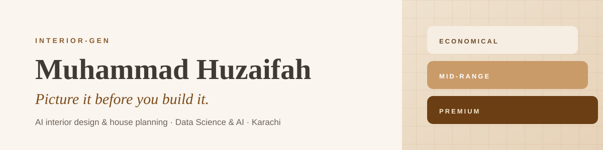

  

I build **Interior-Gen**, an AI platform that turns a room photo into three priced redesigns, and a plot's dimensions into a feasibility-checked floor plan with a real AutoCAD file. It began as a Saylani internship project and I have built it out myself, end to end.

**Live:** [interior-gen-eight.vercel.app](https://interior-gen-eight.vercel.app)

&nbsp;

**What I work with**
Python, FastAPI, PostgreSQL, generative image models, scikit-learn, TensorFlow

**Currently**
Data Science & AI intern at Saylani, Karachi. Building Interior-Gen.

&nbsp;

[LinkedIn](https://www.linkedin.com/in/muhammad-huzaifah-701947376)
